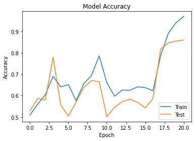

# Text Classification
## Text Classification using TensorFlow
**Project Criteria**
* The dataset to be used is free, but has a minimum of 1000 samples.
* Must use LSTM in model architecture.
* Must use sequential model.
* Validation set is 20% of the total dataset.
* Must use Embedding.
* Must use tokenizer function.
* The accuracy of the model is at least 75% on the train set and validation set.

## Dataset
I'm using a dataset from [Kaggle](https://www.kaggle.com/atulanandjha/imdb-50k-movie-reviews-test-your-bert) and put it into my Google Drive to make it easier to process.

## Model Accuracy


## Libraries used (python)
```
TensorFlow
Matplotlib
``` 
